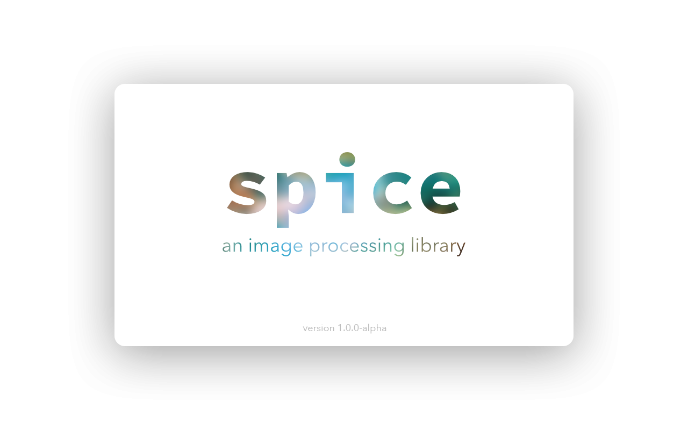
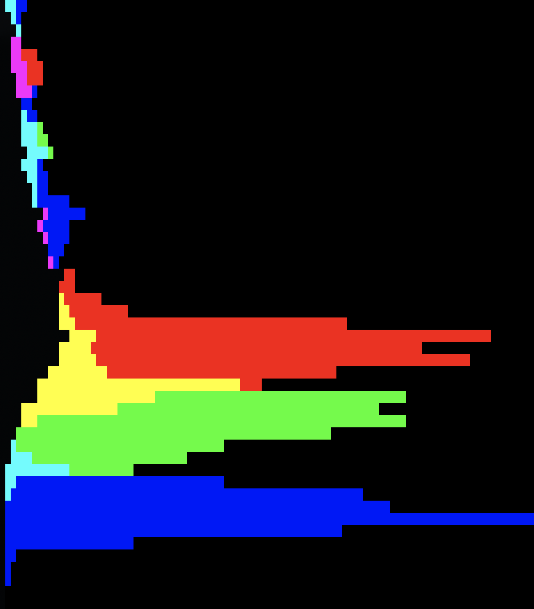

# spice-lib. An image processing library.

[](https://travis-ci.com/JanHett/spice-lib)  [](https://github.com/XAMPPRocky/tokei)

spice-lib, or spice for short, is a set of image processing tools built on top of custom data types.

spice also provides a small wrapper around [OpenImageIO](https://openimageio.readthedocs.io/) reading and writing operations to facilitate input and output. In a future release this wrapper and the dependency on OIIO will be made optional.

## Examples

### Colour arithmetic

spice allows you to handle colours almost as easily as scalars.

```c++
using namespace spice;

color<float, 3> c1{0.2, 0.47, 1};
auto c2 = c1 * 0.5;
c1 += c2;

std::cout << c1 << ", " << c2 << '\n';
```

Output

```
color(0.3, 0.705, 1.5), color(0.1, 0.235, 0.5)
```

### Non-owning `color_view` type

If you want to have the same flexibility without taking ownership of the underlying memory, you can use `color_view` to construct a wrapper exposing the same operations.

```c++
/**
 * Brighten an image contained in a raw buffer. For the sake of this example,
 * we'll assume planar, row-major memory layout.
 */
void brighten(float * data, size_t width, size_t height, size_t nchannels,
    float brightness)
{
    for (size_t y = 0; y < height; ++y) {
        for (size_t x = 0; x < width; ++x) {
            spice::color_view<float> pixel(
                // the offset of the first sample in memory
                data + y * width + x,
                // the stride between samples - in this case one entire plane
                width * height,
                // the number of channels
                nchannels);

            // use color_view's operator*= to adjust brightness
            pixel *= brightness;
        }
    }
}
```

### Reading an image, calculating its histogram and printing it to the terminal

> **Note:** This will only work on terminals that can display full 8bpc colour.

```c++
using namespace spice;

// read an image from a file
auto boat = load_image<float, 3>("./data/testing/boat.jpg");

// print the image to stdout
std::cout << "Printing images to the console is fast and easy!\n";
print::image<float, 3>(boat, 10);

// calculate a histogram with 50 "buckets"
auto hist = statistics::histogram(boat, 50);

// print the histogram to stdout - the peaks will be scaled to a height of 100 characters
print::histogram(hist, 100);
```

This will result in the following output:




Not glamorous, but for retro-cool and debugging it does the job.

## Building, installing and using spice-lib in your CMake build

See [INSTALL.md](./INSTALL.md).

## History

This is the fourth iteration of a "learning-by-failing-and-starting-over" project of mine. The idea is to build an understanding for image processing by building this library from the ground up.

## Credits

The build system has been adapted from cmake init: https://github.com/cginternals/cmake-init

Backing image of spice splash screen and favicon: Crab Nebula by NASA/STScI: https://hubblesite.org/contents/media/images/2005/37/1823-Image.html?news=true